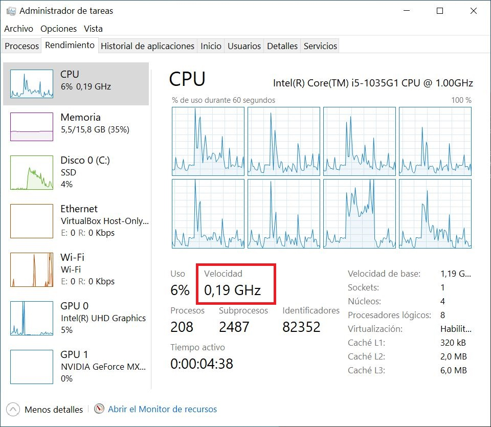

# Desactivar el BDPROCHOT en Windows
**⚠️AVISO⚠️**: NO ME HAGO RESPONSABLE DE CUALQUIER DAÑO NI INCONVENIENTE CAUSADO AL EQUIPO O DISPOSITIVO POR SEGUIR ESTA GUÍA O HACER UN USO INDEBIDO DE ELLA. LA GUÍA ESTÁ BASADA EN MI EXPERIENCIA VIVIDA, Y NO DEBE TOMARSE COMO UNA SOLUCIÓN ABSOLUTA. USA ESTA INFORMACIÓN CON CAUTELA O CONSULTA CON UN EXPERTO
## ¿Qué es el BDPROCHOT?
¿Tu ordenador va extremadamente lento? ¿O notas que se limita cuando le das máxima potencia al procesador, y quieres evitarlo? Probablemente tengas un problema con el BDPROCHOT.  
El BDPROCHOT es un sensor en la placa de tu portátil usado para controlar el calor del procesador (de ahí sus siglas, Bi-Directional PROCessor HOT). Éste envía una señal al procesador para que cuando alcance altas temperaturas ponga la CPU en throttling mode (la estrangule) y limite su frecuencia a pocos GHz. 
## ¿Cómo saber si me afecta?
Es un sensor que es muy común que falle, por lo que no estaría mal comprobar si te está afectando.  
Usa tu portátil sin estar enchufado a la corriente y sigue los siguientes pasos:
1. En el escritorio, comprueba su velocidad. Por ejemplo, prueba a darle varias veces al botón de inicio, debería verse una notable lentitud.
2. Abre el Administrador de tareas. Si te va tan lento que no tienes paciencia, pulsa los botones `Ctrl`+`Shift`+`Esc` a la vez. Ábrelo en la versión detallada, ve a la pestaña "*Rendimiento*" y comprueba la frecuencia de tu CPU. Si es tan bajo como en la siguiente imagen, deberías preocuparte.  

3. Descarga la herramienta ThrottleStop desde aquí: https://www.techpowerup.com/download/techpowerup-throttlestop/. Ejecútala, comprueba que BDPROCHOT esté activado... **TODO**

## ¿Cómo lo desactivo?
Este sensor se puede desactivar de diversas maneras, yo traigo la que considero mejor solución. Hay que tener en cuenta que el sensor se vuelve a activar cada vez que el portátil se enciende o vuelve de suspensión/hibernación, por lo que hay que adaptar la solución a esas situaciones (ver luego en el apartado **TODO**)  
La manera más fácil y común es usando el programa [ThrottleStop](https://www.techpowerup.com/download/techpowerup-throttlestop/) y desactivar la casilla que pone *BDPROCHOT*, pero debes configurarlo para que el programa se ejecute al encender y desbloquear el ordenador.  
## Mi solución
Mi solución trata de modificar un registro del procesador para que no tenga en cuenta el BDPROCHOT, y todo se hará desde el CMD de Windows. Consta de 3 partes: preparativos, tener un script y programar la ejecución. La gracia de esta solución, es que en vez de ejecutar un programa entero y tenerlo ejecutado en el fondo, solo llamas a varias lineas de CMD en un momento (es más eficiente).
### 1. Preparativos
### 2. Tener un script
**ELEGIR UNO DE LOS SIGUIENTES APARTADOS** Es mucho más seguro el primero
### 2.a Usar un script manual
[*Ir al paso 3*](#3-programar-la-ejecución)
### 2.b Usar un script automático

### 3. Programar la ejecución
<!--<h3 id="MiSolucion3">3. Programar la ejecución</h3>-->

## Créditos y agradecimientos
- cocafe por su herramienta para escribir en los registros: https://github.com/cocafe/msr-utility
- Voodooman por su script para convertir de hexadecimal a decimal y viceversa en un Batch: https://www.dostips.com/forum/viewtopic.php?t=2261
- Los desarrolladores de ThrottleStop por hacer una herramienta tan útil: https://www.techpowerup.com/download/techpowerup-throttlestop/
- Las numerosas guías para desactivar el BDPROCHOT en Windows y Linux
- Y a ChatGPT xd